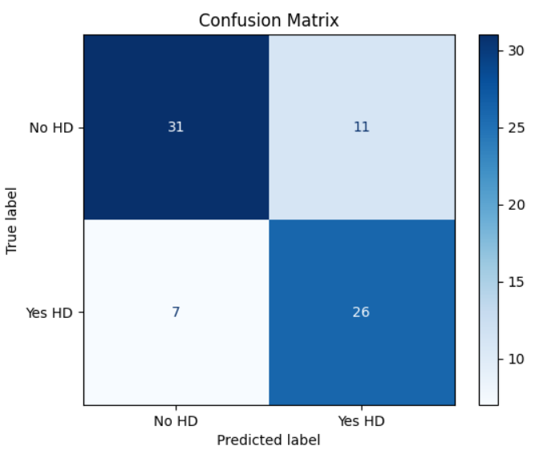
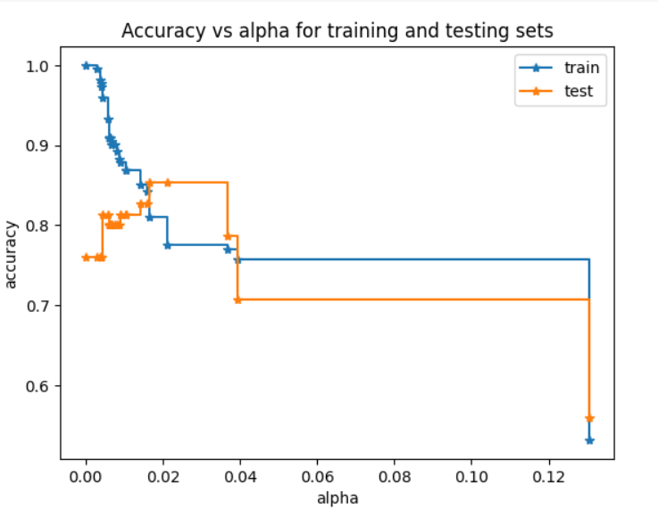
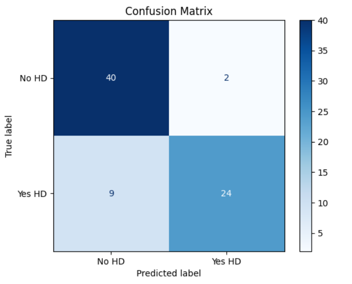

# 🫀 Heart Disease Prediction using Decision Tree Classifier

This project uses machine learning to predict the likelihood of a person having heart disease based on clinical data. We built and evaluated a **Decision Tree Classifier**, with visualization and pruning techniques to optimize performance.

---

## 📁 Project Structure

Heart-Disease-Prediction/
├── Heart_Disease_Prediction.ipynb
├── confusion_matrix_before_pruning.png
├── confusion_matrix_after_pruning.png
└── README.md

---

## 📌 Problem Statement

Heart disease remains one of the leading causes of death globally. This project focuses on building a classification model that can predict heart disease using patient health attributes, enabling early diagnosis and treatment planning.

---

## 🧾 Dataset Features

- `age`: Age of the patient
- `sex`: Gender (1 = male; 0 = female)
- `cp`: Chest pain type (4 values)
- `trestbps`: Resting blood pressure
- `chol`: Serum cholesterol
- `fbs`: Fasting blood sugar > 120 mg/dl
- `restecg`: Resting electrocardiographic results
- `thalach`: Maximum heart rate achieved
- `exang`: Exercise-induced angina
- `oldpeak`: ST depression induced by exercise
- `slope`: Slope of the peak exercise ST segment
- `ca`: Number of major vessels colored by fluoroscopy
- `thal`: Thalassemia
- `target`: Diagnosis (1 = heart disease, 0 = no heart disease)

---

## 🧠 Approach

1. **Data Preprocessing**
   - Handled categorical features using one-hot encoding.
   - Split the dataset into training and testing sets.
2. **Model Training**
   - Trained a Decision Tree Classifier using scikit-learn.
3. **Evaluation**
   - Evaluated with confusion matrix, accuracy, and pruning path.
4. **Pruning**
   - Used `cost_complexity_pruning_path` to avoid overfitting.
   - Selected optimal alpha (0.02) for model pruning.
5. **Visualization**
   - Visualized decision tree and confusion matrices.

---

## 📈 Visual Results

### 🔹 Confusion Matrix (Before Pruning)

- **Train Accuracy**: ~81%
- **Test Accuracy**: ~85.3%

---
### 📉 Accuracy vs Alpha (Training vs Testing)

### 🌳 Decision Tree Visualization (After Pruning)

### 🔹 Confusion Matrix (After Pruning)

- **Train Accuracy**: 81.08%
- **Test Accuracy**: 85.33%

✅ Pruning helped reduce model complexity and slightly improved generalization.

---

## 🔍 Key Findings

- `ca`, `thal`, and `cp` were highly influential in determining heart disease.
- Decision Trees offer excellent model interpretability.
- Pruning is critical to balance bias and variance.

---

## 🛠️ Tech Stack

- Python
- Pandas & NumPy
- Matplotlib & Seaborn
- scikit-learn

---

## ✅ Conclusion

A simple yet effective Decision Tree Classifier achieved over **85% test accuracy** in heart disease prediction. Pruning significantly improved model generalization by reducing overfitting, making the model more practical for real-world applications.

---

## 🚀 Future Improvements

- Explore advanced models like Random Forest and XGBoost
- Apply k-fold cross-validation for robust performance
- Deploy the model using Flask or Streamlit for user interaction

---

## ✍️ Author

**Sapana Khatiwada**  
Machine Learning Enthusiast | Data Science Learner  
https://github.com/sapana27