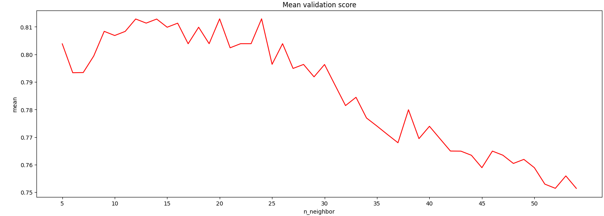
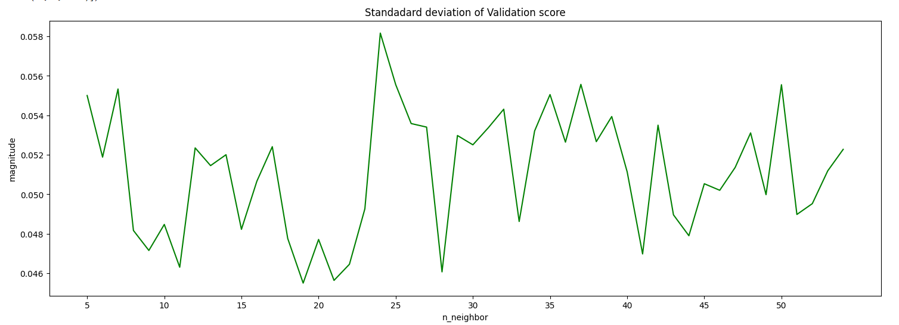

# 🚢 Titanic Survivor Prediction using K-Nearest Neighbors (KNN)

This project aims to predict the survival of passengers on the Titanic using the K-Nearest Neighbors (KNN) algorithm. It includes steps such as data preprocessing, cross-validation, hyperparameter tuning, and performance evaluation through visualizations.

---

## 📁 Project Structure

- **Data Preparation**: The dataset is standardized using feature scaling for better model performance.
- **Train-Test Split**: The dataset is divided into training and testing sets with stratification to maintain class balance.
- **Model Selection**: Cross-validation is used to evaluate model consistency and to select the optimal number of neighbors (`n_neighbors`).
- **Hyperparameter Tuning**: A range of neighbor values is tested to determine the best value that gives a high mean accuracy and low variance.
- **Model Evaluation**: The best model is trained and evaluated on both training and test sets.

---

## 📊 Results

- **Cross-validation Mean Accuracy**: ~80.84%
- **Standard Deviation**: ~4.72%
- **Best n_neighbors**: 11
- **Training Accuracy**: ~83.53%
- **Testing Accuracy**: ~78.48%

---

## 📈 Visualizations

###  Mean Validation Score & Standard Deviation

Plots were generated to visualize the mean cross-validation accuracy and standard deviation for `n_neighbors` values ranging from 5 to 50. These helped in identifying the optimal K-value that balances bias and variance.

---

## 🔗 Project Repository

[Click here to view the full project on Notebook](https://github.com/sapana27/Titanic_Survival_Prediction)

---

## ✅ Conclusion

- KNN is an effective algorithm for classification on the Titanic dataset.
- Hyperparameter tuning using cross-validation significantly improved performance.
- Visual inspection and quantitative metrics support the choice of `n_neighbors = 11` as optimal.

---

## 👤 Author

**Sapana Khatiwada**  
GitHub: [@sapana27](https://github.com/sapana27)

---

## 📄 License

This project is licensed under the MIT License.
